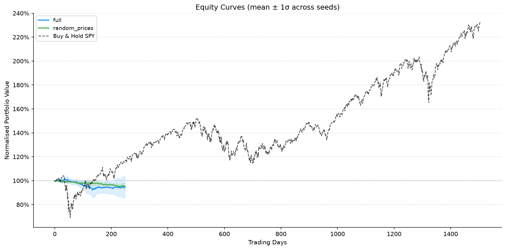

# PPO Trading Agent — A Controlled Evaluation

A reinforcement learning system that trains a Proximal Policy Optimisation agent to allocate capital across a seven-asset portfolio, built to test one question properly: **does a PPO agent trained on price features have any out-of-sample edge?**

**The answer, on the evidence here, is no.** The agent lost money on held-out data and performed no better than an identical agent trained on price series with all temporal structure destroyed. Details below.

This repository is about the evaluation methodology as much as the agent. Most published RL trading results do not survive walk-forward validation, multi-seed reporting, and a shuffled-input control. This one is set up so those checks are the default rather than an afterthought.

## Results

Fold 1: trained on 2020-01-01 → 2022-12-31, tested on 2023 (250 unseen trading days). Five seeds (42, 123, 456, 789, 2024), reported as mean ± standard deviation.

| Configuration | Total return | Sharpe | Max drawdown |
|---|---|---|---|
| PPO agent (`full`) | −5.54% ± 9.95% | **−0.73 ± 1.39** | −12.11% ± 7.33% |
| Shuffled-price control | −4.70% ± 2.75% | −1.19 ± 0.66 | −6.21% ± 2.02% |
| Equal-weight buy-and-hold | **+57.74%** | **+2.84** | −8.78% |
| SPY buy-and-hold | +26.71% | +1.90 | −9.97% |

### What the numbers say

**The agent has no measurable edge.** Per-seed Sharpe ratios were −0.66, −1.55, **+1.27**, −0.28 and −2.43. The 95% confidence interval on the mean is **[−2.46, +1.00]** — comfortably containing zero. Taking the single positive seed as evidence of skill would be exactly the error this evaluation setup exists to prevent.

**It is statistically indistinguishable from its own control.** Welch's t-test comparing the agent against the shuffled-price condition gives **p = 0.53**. An agent trained on prices with the time axis scrambled — carrying no learnable signal by construction — performed the same as one trained on real data.

**It overfits severely.** Best in-sample return was **+65.84%** against **−8.66%** out of sample on the same seed. The policy memorised the training window.

**It did not even capture market beta.** 2023 was a strong bull year: equal-weight buy-and-hold on these same seven assets returned +57.7%, and NVDA alone returned +246%. The agent lost 5.5% while turning over 9× annually across roughly 400 trades. Its 67% win rate alongside negative total return means losing trades were substantially larger than winning ones — consistent with cutting winners early and holding losers.

**The control condition validates the harness.** Had `random_prices` come back positive, it would indicate information leaking through the evaluation pipeline and every other number here would be void. It came back negative, so the negative result is a real property of the agent rather than an artefact of measurement.



### Scope and honesty about it

These figures are from **fold 1 only** (10 training runs, ~8 hours on Apple Silicon MPS). The complete design is 3 folds × 5 ablations × 5 seeds = 75 runs, roughly 60 hours, which has not been run. The `no_short`, `naive_reward` and `no_noise` ablations are implemented and configured but not yet executed.

The conclusion is therefore stated as: *no edge demonstrated on fold 1*, not *no edge exists*. Extending to folds 2 and 3 is the obvious next step, though since the failure mode is overfitting rather than undertraining, additional compute would most likely confirm rather than overturn it.

## Design

**Universe.** AAPL, NVDA, MSFT, JPM, XOM, SPY, QQQ — spanning technology, financials, energy and broad-market ETFs, so the agent cannot succeed by riding a single sector. VIX enters as an exogenous state feature.

**Agent.** PPO with per-asset independent action heads, keeping parameter count linear in the number of assets rather than combinatorial. Position sizing is bounded per asset and in aggregate.

**Reward.** Portfolio return penalised for drawdown beyond a threshold and for turnover, so the policy is not rewarded for unbounded leverage or churn.

**Frictions.** Flat commission, 0.1% slippage, 5bp bid–ask half-spread, 2% annual borrow cost on shorts, 30% maximum single-asset weight, and T+1 execution lag. A backtest without these is not informative.

**Ablations.**

| Ablation | Removes |
|---|---|
| `full` | — |
| `no_short` | Short selling |
| `naive_reward` | Risk-adjusted reward shaping |
| `no_noise` | Observation noise augmentation |
| `random_prices` | Temporal structure (control condition) |

## Running it

```bash
python3 -m venv .venv && source .venv/bin/activate
pip install -r requirements.txt

python experiments/run_suite.py --config config_primary.yaml --dry-run

# One fold, two ablations (~8 hours on MPS)
python experiments/run_suite.py --config config_primary.yaml \
    --folds fold_1 --ablations full random_prices

# Full suite (~60 hours)
python experiments/run_suite.py --config config_primary.yaml
```

Outputs land in `results_primary/`: `metrics_raw.csv` (per seed), `metrics_summary.json` (mean ± std), `ablation_table.csv`, and `plots/`.

Prices are cached locally, so the primary study runs entirely offline.

### Sentiment sub-study

`config_sentiment.yaml` defines a separate, **explicitly exploratory** study incorporating FinBERT sentiment over financial news:

```bash
export FINNHUB_KEY="your_key"        # free tier at finnhub.io
pip install transformers
python experiments/run_suite.py --config config_sentiment.yaml
```

It is scoped to a single fold over a twelve-month window because Finnhub's free tier returns roughly one year of company news — verified empirically with `probe_news.py`. A ~70-day test window cannot support a Sharpe estimate with usable error bars, so this study can indicate a direction and nothing more. It is kept separate from the primary study for that reason.

## Method notes

**Why PPO.** On-policy clipped-objective methods are more stable than value-based approaches in continuous action spaces with very low signal-to-noise rewards. In this regime update stability matters more than sample efficiency.

**Why walk-forward rather than a random split.** Financial series are non-stationary and autocorrelated. A random train/test split leaks future information through both channels and produces a flattering, meaningless result.

**Why five seeds.** Seed variance here (Sharpe std 1.39) is larger than any effect being tested. A single-seed result would have been pure noise reported as a finding — and would have looked impressive had seed 456 been the one chosen.

**Why a shuffled-price control.** It is the only way to distinguish a learned signal from a harness that manufactures one. It should be run before believing any positive result.

## Limitations

- Daily rebalancing only; no intraday dynamics, order book, or market impact beyond fixed slippage
- Survivorship bias — the seven tickers were selected knowing which have performed well
- Fixed transaction costs; real spreads widen exactly when a strategy most wants to trade
- Seven assets is a demonstration, not a portfolio
- No explicit regime detection; walk-forward folds may span very different market conditions
- Results cover one fold; the full design is not yet executed

## Layout

```
rl_trading_v2/
├── config_primary.yaml      # price-only study (3 folds × 5 ablations × 5 seeds)
├── config_sentiment.yaml    # exploratory sentiment sub-study
├── probe_news.py            # diagnostic: how far back does the news API go?
├── data/                    # fetching, features, sentiment scoring
├── env/                     # trading environment, frictions, reward
├── agent/                   # PPO policy and value networks, rollout buffer
├── training/                # trainer, walk-forward fold construction
├── evaluation/              # metrics, ablation configs, plotting
└── experiments/run_suite.py # entry point
```

## References

Schulman et al. (2017), *Proximal Policy Optimization Algorithms*, arXiv:1707.06347
Araci (2019), *FinBERT: Financial Sentiment Analysis with Pre-trained Language Models*, arXiv:1908.10063

## Author

Ava Ahmadi — BSc Mathematics, University of British Columbia
[GitHub](https://github.com/ava-28)

---

*Research and educational purposes only. Not investment advice, and emphatically not a strategy to trade with real capital.*
