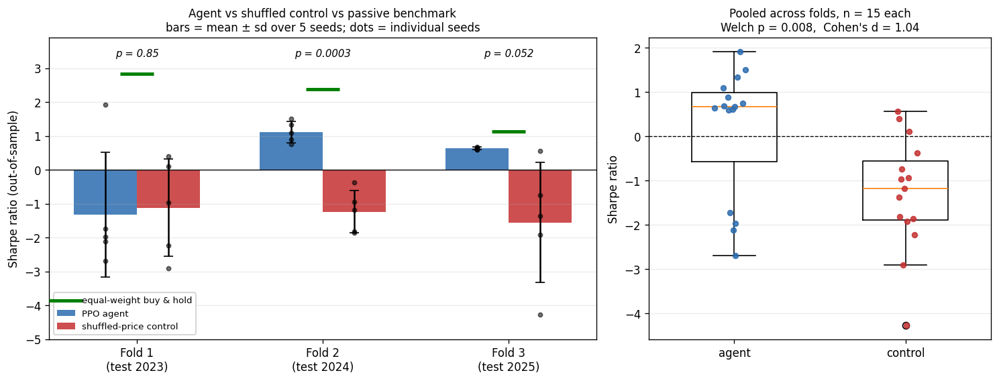

# PPO Trading Agent — A Controlled Evaluation

A reinforcement learning system that trains a Proximal Policy Optimisation agent to allocate capital across a seven-asset portfolio, built to test one question properly: **does a PPO agent trained on price features have any out-of-sample edge?**

**The answer is nuanced, and both halves matter.** Across three walk-forward folds the agent significantly outperforms an identical agent trained on price series with all temporal structure destroyed (p = 0.008, Cohen's d = 1.04) — so it is learning something real. But its confidence interval contains zero, and equal-weight buy-and-hold beats it in every fold. It finds signal; the signal is not worth trading.

This repository is about the evaluation methodology as much as the agent. Most published RL trading results do not survive walk-forward validation, multi-seed reporting, and a shuffled-input control. This one is set up so those checks are the default rather than an afterthought.

## Results

Complete 3 × 2 × 5 grid: three non-overlapping walk-forward folds, two configurations, five seeds each. **30 training runs**, 250 episodes apiece. Reported as mean ± standard deviation across seeds.

| Fold | Test window | PPO agent | Shuffled-price control | Welch *p* |
|---|---|---|---|---|
| 1 | 2023 | −1.324 ± 1.846 | −1.122 ± 1.437 | 0.85 |
| 2 | 2024 | **+1.112 ± 0.314** | −1.237 ± 0.624 | **0.0003** |
| 3 | 2025 | **+0.633 ± 0.038** | −1.554 ± 1.781 | 0.052 |
| **Pooled** | 2023–2025 | **+0.140 ± 1.480** | −1.304 ± 1.282 | **0.008** |

*(Sharpe ratios. Pooled n = 15 per condition, Cohen's d = 1.04.)*

Against passive benchmarks over the same windows:

| Fold | Agent return / Sharpe | Equal-weight buy-and-hold | SPY buy-and-hold |
|---|---|---|---|
| 1 (2023) | −5.53% / −1.324 | **+57.74% / +2.836** | +26.71% / +1.896 |
| 2 (2024) | +11.64% / +1.112 | **+43.73% / +2.385** | +25.59% / +1.882 |
| 3 (2025) | +11.30% / +0.633 | **+25.08% / +1.131** | +18.89% / +0.996 |

### What the numbers say

Two findings, both true, pointing in different directions.

**1. The agent learns real temporal structure.** Pooled across folds it outperforms the shuffled-price control at **p = 0.008** with **Cohen's d = 1.04** — a large effect. In fold 2 alone, p = 0.0003. Destroying the time axis, which removes all learnable signal by construction, collapses performance. Whatever the agent is doing, it depends on genuine sequential structure in prices rather than on artefacts of the evaluation harness.

This is the claim the control condition exists to support, and it is the reason the control is worth running: had `random_prices` matched or beaten the agent, every other number here would be void.

**2. It has no reliable absolute edge, and loses to doing nothing.** The 95% confidence interval on the agent's pooled Sharpe is **[−0.679, +0.960]** — it contains zero. And equal-weight buy-and-hold beats it in **all three folds on both return and Sharpe**, without a model, without training, and without paying transaction costs.

"Learns signal, but not enough signal to be worth trading" is the honest summary.

**Regime dependence dominates everything.** Fold 1 (2023): Sharpe −1.32, indistinguishable from noise. Fold 2 (2024): +1.11, strongly significant. Fold 3 (2025): +0.63. The spread across folds is larger than the spread across seeds within any fold. A single-fold study would have supported almost any conclusion you wanted — which is precisely the argument for walk-forward validation.

**One anomaly worth flagging.** Fold 3's agent Sharpe has a standard deviation of **0.038** across five seeds, against 1.85 in fold 1. That is implausibly tight for reinforcement learning and suggests every seed converged to a near-identical, largely static long exposure — effectively rediscovering buy-and-hold at lower leverage. The +11.30% return against buy-and-hold's +25.08% is consistent with that reading. Not yet investigated.



*Left: per-fold comparison. Black dots are individual seeds — note fold 3's agent seeds are nearly coincident (sd = 0.038) while fold 1's span 4 Sharpe points. Green dashes mark equal-weight buy-and-hold, above the agent in every fold. Right: pooled distributions.*

### Scope

Two configurations (`full`, `random_prices`) across all three folds. The `no_short`, `naive_reward` and `no_noise` ablations are implemented and configured but not executed — at roughly 25 minutes per run they add ~19 hours, which has not been spent.

So the component-attribution question ("which part matters?") is open. The signal-versus-noise question ("does it learn anything real?") is answered: yes, p = 0.008. The usefulness question ("should anyone trade it?") is also answered: no.

## Design

**Universe.** AAPL, NVDA, MSFT, JPM, XOM, SPY, QQQ — spanning technology, financials, energy and broad-market ETFs, so the agent cannot succeed by riding a single sector. VIX enters as an exogenous state feature.

**Agent.** PPO with per-asset independent action heads, keeping parameter count linear in the number of assets rather than combinatorial. Position sizing is bounded per asset and in aggregate.

**Reward.** Portfolio return penalised for drawdown beyond a threshold and for turnover, so the policy is not rewarded for unbounded leverage or churn.

**Frictions.** Flat commission, 0.1% slippage, 5bp bid–ask half-spread, 2% annual borrow cost on shorts, 30% maximum single-asset weight, and T+1 execution lag. A backtest without these is not informative.

**Ablations.**

| Ablation | Removes |
|---|---|
| `full` | — |
| `no_short` | Short selling |
| `naive_reward` | Risk-adjusted reward shaping |
| `no_noise` | Observation noise augmentation |
| `random_prices` | Temporal structure (control condition) |

## Running it

```bash
python3 -m venv .venv && source .venv/bin/activate
pip install -r requirements.txt

python experiments/run_suite.py --config config_primary.yaml --dry-run

# One fold, two ablations (~8 hours on MPS)
python experiments/run_suite.py --config config_primary.yaml \
    --folds fold_1 --ablations full random_prices

# Full suite (~60 hours)
python experiments/run_suite.py --config config_primary.yaml
```

Outputs land in the configured `results_dir`: `metrics_raw.csv` (per seed), `metrics_summary.json` (mean ± std), `ablation_table.csv`, and `plots/`.

Prices are cached locally, so the primary study runs entirely offline.

### Sentiment sub-study

`config_sentiment.yaml` defines a separate, **explicitly exploratory** study incorporating FinBERT sentiment over financial news:

```bash
export FINNHUB_KEY="your_key"        # free tier at finnhub.io
pip install transformers
python experiments/run_suite.py --config config_sentiment.yaml
```

It is scoped to a single fold over a twelve-month window because Finnhub's free tier returns roughly one year of company news — verified empirically with `probe_news.py`. A ~70-day test window cannot support a Sharpe estimate with usable error bars, so this study can indicate a direction and nothing more. It is kept separate from the primary study for that reason.

## Method notes

**Why PPO.** On-policy clipped-objective methods are more stable than value-based approaches in continuous action spaces with very low signal-to-noise rewards. In this regime update stability matters more than sample efficiency.

**Why walk-forward rather than a random split.** Financial series are non-stationary and autocorrelated. A random train/test split leaks future information through both channels and produces a flattering, meaningless result.

**Why five seeds.** Seed variance within fold 1 (Sharpe std 1.85) exceeds the pooled effect being tested. A single-seed result would have been noise reported as a finding.

**Why the run is resumable.** Each (fold, ablation, seed) is appended to `metrics_incremental.csv` as it completes, and already-finished combinations are skipped on restart. This was added after a power loss killed run 28 of 30 and, in the original design, would have discarded all 27 completed runs.

**Why a shuffled-price control.** It is the only way to distinguish a learned signal from a harness that manufactures one. It should be run before believing any positive result.

## Limitations

- Daily rebalancing only; no intraday dynamics, order book, or market impact beyond fixed slippage
- Survivorship bias — the seven tickers were selected knowing which have performed well
- Fixed transaction costs; real spreads widen exactly when a strategy most wants to trade
- Seven assets is a demonstration, not a portfolio
- No explicit regime detection; walk-forward folds may span very different market conditions
- Three of five ablations not yet run, so component attribution is unresolved
- Fold 3's near-zero seed variance is unexplained and may indicate policy collapse to static exposure

## Layout

```
rl_trading_v2/
├── config_primary.yaml      # price-only study (3 folds × 5 ablations × 5 seeds)
├── config_sentiment.yaml    # exploratory sentiment sub-study
├── probe_news.py            # diagnostic: how far back does the news API go?
├── data/                    # fetching, features, sentiment scoring
├── env/                     # trading environment, frictions, reward
├── agent/                   # PPO policy and value networks, rollout buffer
├── training/                # trainer, walk-forward fold construction
├── evaluation/              # metrics, ablation configs, plotting
└── experiments/run_suite.py # entry point
```

## References

Schulman et al. (2017), *Proximal Policy Optimization Algorithms*, arXiv:1707.06347
Araci (2019), *FinBERT: Financial Sentiment Analysis with Pre-trained Language Models*, arXiv:1908.10063

## Author

Ava Ahmadi — BSc Mathematics, University of British Columbia
[GitHub](https://github.com/ava-28)

---

*Research and educational purposes only. Not investment advice, and emphatically not a strategy to trade with real capital.*
